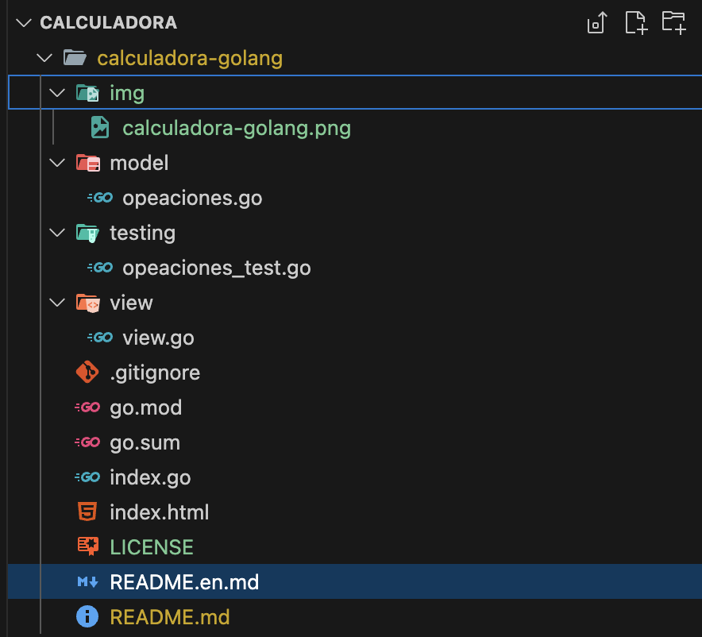

# Calculadora en Go 
 
Este proyecto es una **calculadora sencilla** desarrollada en **Golang**, que permite realizar operaciones básicas entre dos números desde la consola:

- ➕ Suma
- ➖ Resta
- ✖️ Multiplicación
- ➗ División

## Descripción 📌

La calculadora está diseñada para ejecutarse en la terminal y recibir la entrada del usuario, procesando las operaciones mediante funciones separadas para mantener un código limpio y modular.

Versión en [ingles](./README.en.md)


## Comenzando 🚀

Para comenzar a utilizar la calculadora, sigue estos pasos:

1. Clona el repositorio en tu máquina local:
   ```bash
   git clone https://github.com/12345star/calculadora-golang.git
   ```

2. Navega al directorio del proyecto:
   ```bash
   cd calculadora-golang
   ```

## Pre-requisitos 📋

Asegúrate de tener instalado **Go** en tu sistema.

 **GO** 1.18 o superior
 
 * Pagina oficial de [Golang](https://go.dev)
 * Pagina de  [Testify](https://github.com/stretchr/testify)
 * Pagina de [modulo tidy](https://go.dev/ref/mod#go-mod-tidy)

## Dependencias  📦

**Ejecuta los siguientes comandos en tu terminal:**

```bash
go mod init calculadora
```

```bash
go mod tidy
```

```bash
go get github.com/stretchr/testify/assert
```

## Ejecutando las pruebas ⚙️
1. comando para ejecutar la calculadora:
   ```bash
   go run index.go <num1> <operador> <num2>
   ```   
   1. Suma:
   ```bash
   go run index.go 5 + 3
   ```
   2. Resta:
   ```bash
   go run index.go 5 - 3
   ```
   3. Multiplicación:
   ```bash
   go run index.go 5 * 3
   ```
   4. División:
   ```bash
   go run index.go 6 / 3
   ```   

---
## Pruebas Unitarias 🧪

Para ejecutar las pruebas, utiliza el siguiente comando:

```bash
go test ./...
```

---
## Licencia 📄 

Este proyecto está bajo la Licencia **MIT**.  

Puedes usarlo, modificarlo y distribuirlo libremente.

Consulta el archivo [MIT](./LICENSE).

---
## Autor ✨ 

Creado con ❤️ por [@David](https://github.com/12345star)  
* **David Salas** - *Trabajo Inicial* - [David](https://github.com/12345star)
* **David Salas** - *Documentación* - [David](https://github.com/12345star)
---
    
## Estructura del proyecto 📂

```plaintext
.
├── index.go                    # Punto de entrada principal
├── README.md                   # Documentación del proyecto
├── LICENSE                     # Licencia del proyecto
├── .gitignore                  # Archivos y carpetas a ignorar por Git
├── img/                        # Carpeta para imágenes
│   └── calculadora-golang.png  # Imagen de la estructura del proyecto
├── go.mod                      # Módulo de Go
├── go.sum                      # Dependencias
├── model/
│   └── operaciones.go          # Lógica de operaciones matemáticas
├── testing/
│   └── operaciones_test.go     # Pruebas unitarias
└── view/
    └── view.go                 # Interfaz de entrada/salida en consola

```
---
## Estructura proyecto 🚀
  
  