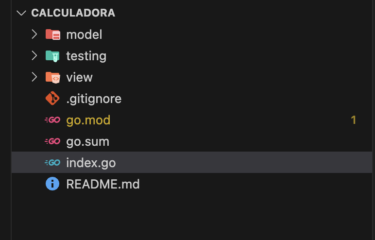

# 🧮 Calculadora en Go

Este proyecto es una **calculadora sencilla** desarrollada en **Golang**, que permite realizar operaciones básicas entre dos números desde la consola:

- ➕ Suma
- ➖ Resta
- ✖️ Multiplicación
- ➗ División

---

## 📌 Descripción

La calculadora está diseñada para ejecutarse en la terminal y recibir la entrada del usuario, procesando las operaciones mediante funciones separadas para mantener un código limpio y modular.

---
## 🛠 Requisitos de instalación

Asegúrate de tener instalado **Go** en tu sistema.

[GO](https://go.dev) 1.18 o superior

Ejecuta los siguientes comandos en tu terminal:

```bash
go mod init calculadora
go mod tidy
go get github.com/stretchr/testify/assert
```
---

## ⚙️ Instalación y uso

1. Clona el repositorio:
   ```bash
   git clone https://github.com/12345star/calculadora-golang.git
   ```
2. Navega al directorio del proyecto:
   ```bash
   cd calculadora-golang
   ```

3. Ejecuta la aplicación:
   1. Suma:
   ```bash
   go run index.go 5 + 3
   ```
   2. Resta:
   ```bash
   go run index.go 5 - 3
   ```
   3. Multiplicación:
   ```bash
   go run index.go 5 * 3
   ```
   4. División:
   ```bash
   go run index.go 6 / 3
   ```   

---
## 🧪 Pruebas

Para ejecutar las pruebas, utiliza el siguiente comando:

```bash
go test ./...
```

---
## 📄 Licencia

Este proyecto está bajo la **Licencia MIT**.  
Puedes usarlo, modificarlo y distribuirlo libremente.

Consulta el archivo [LICENSE](https://opensource.org/license/MIT "licencia MIT ") para más información. 

---
## ✨ Autor

Creado con ❤️ por [@12345star](https://github.com/12345star)  
Mención especial a [@12345star](https://github.com/12345star) por su colaboración.

---
    
## 📂 Estructura del proyecto

```plaintext
.
├── index.go                # Punto de entrada principal
├── go.mod                  # Módulo de Go
├── go.sum                  # Dependencias
├── model/
│   └── operaciones.go      # Lógica de operaciones matemáticas
├── testing/
│   └── operaciones_test.go # Pruebas unitarias
└── view/
    └── view.go              # Interfaz de entrada/salida en consola

```
---
## 🚀 Ejemplo de estructura
  
  